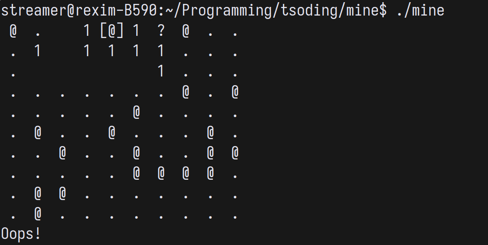

# Terminal Minesweeper



## Quick Start

It's written in [Free Pascal](https://www.freepascal.org/download.html) (i will not apologize).

```console
> edit build_win32.bat
> build_win32.bat
> mine.exe
```

## Controls

| key                                                 | description        |
|-----------------------------------------------------|--------------------|
| <kbd>w</kbd>,<kbd>a</kbd>,<kbd>s</kbd>,<kbd>d</kbd> | Move cursor around |
| <kbd>SPACE</kbd>                                    | Open cell          |
| <kbd>f</kbd>                                        | Flag/unflag cell   |
| <kbd>r</kbd>                                        | Restart            |
| <kbd>q</kbd>                                        | Quit               |
